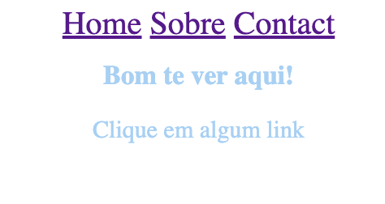
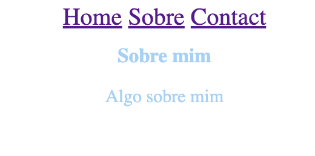
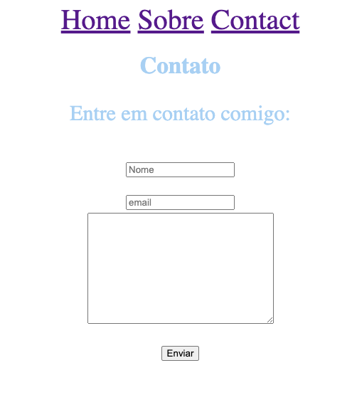
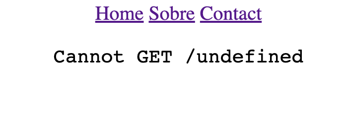
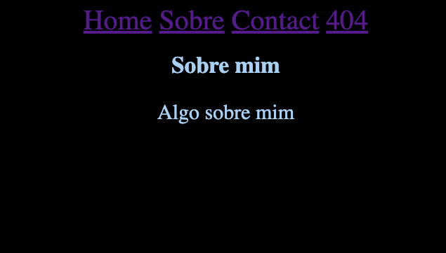
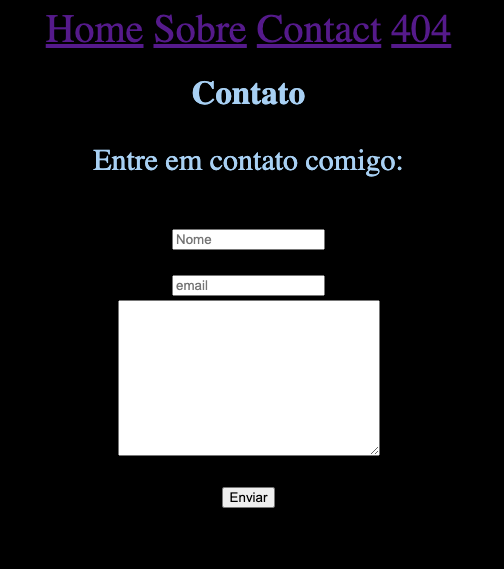
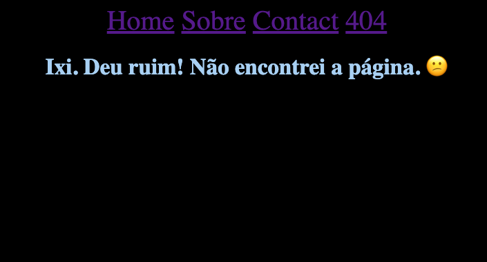

📝 SPA (Single-Page Application)

# 🚀 Project:
In this project I learned the concept of SPA (Single-Page Application) and made an application in practice.

- ES Modules;
- Clean Code Concepts;
- Route mapping;
- Asynchronous and promises;
- Object orientation;
- DOM manipulation;
- Web APIs;
- Refactoring; 
- Classes and more.

# 🛠️ Technologies

- [HTML](../index.html)
- [CSS](../style.css)
- [JavaScript](../javascript.)
- [Git e Github](https://github.com/)
- [Figma](https://figma.com)

# 📸 Screenshots of project: 

## 🔗 [Online project](http://localhost:3000/)

### 🗓️ September 2023 

                  Feito com 💜 by BM